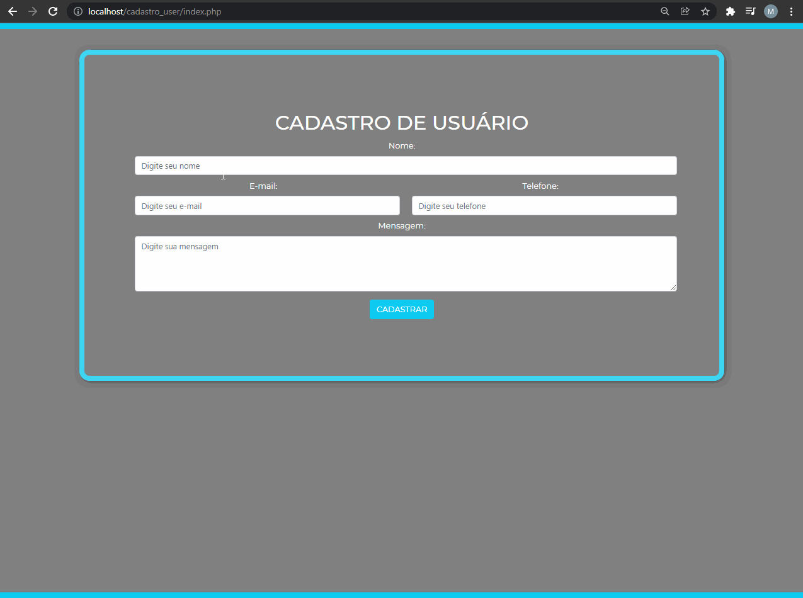

<h2>Cadastro de usuários</h2>

	Utilizando PHP e MySql para armazenar os dados, foi contruída uma simples aplicação 
	de cadastro de usuários, com o auxilio do framework Bootstrap.
	  
	Para executar o projeto, basta usar o Xampp e colocar a pasta dentro de htdocs 
	dentro da pasta 'sql' está o arquivo do banco para utilizar basta importar no PhpMyAdmin.

	

